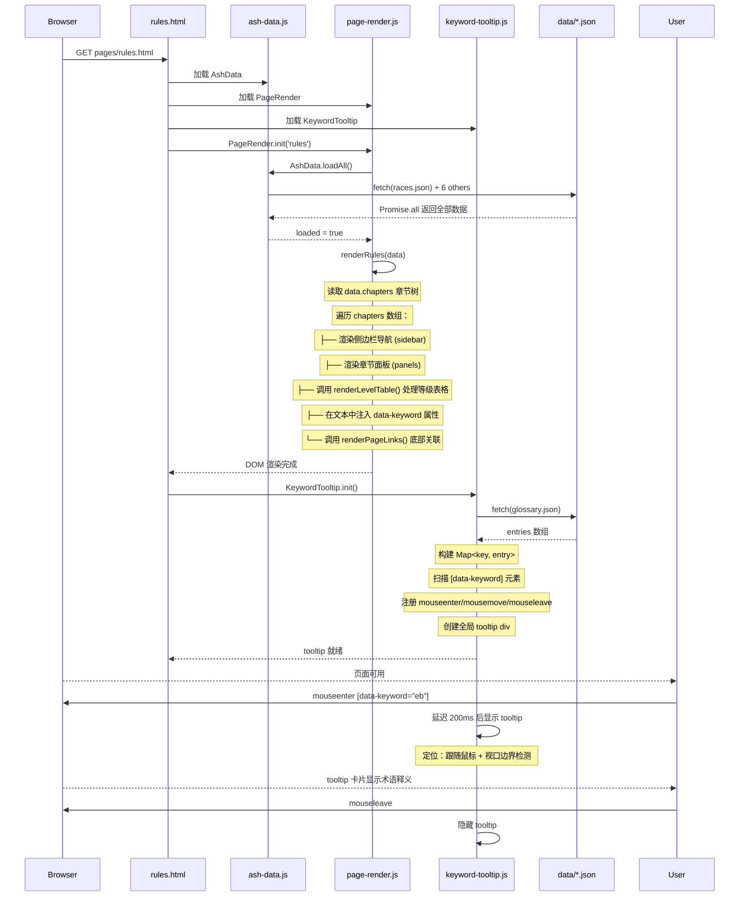
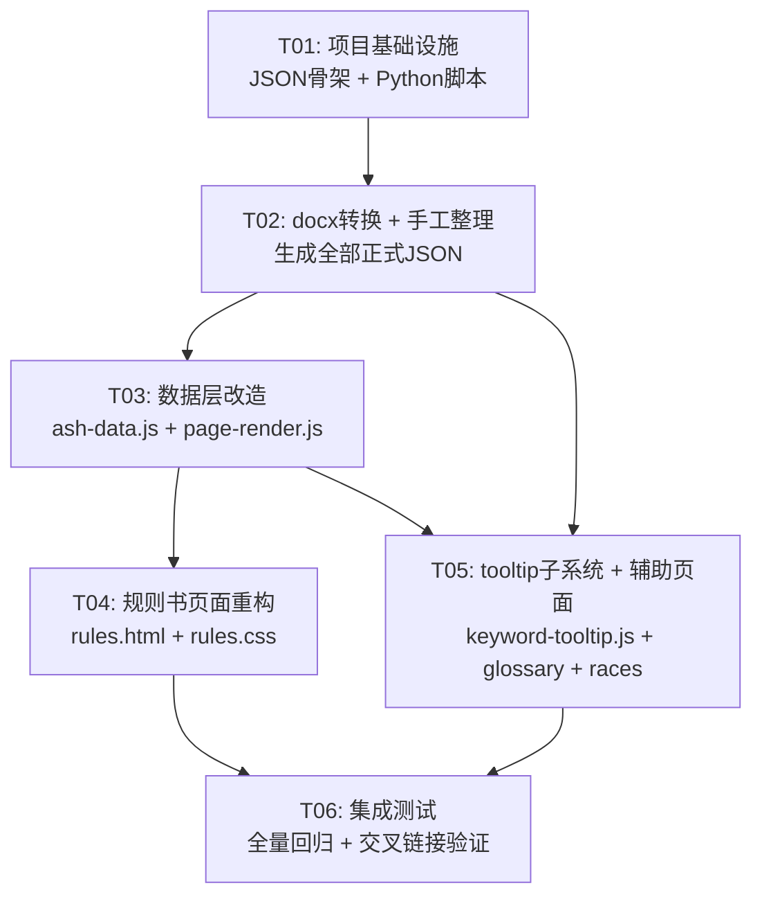

# 灰烬世界 TRPG 规则书 — 系统设计文档

> 版本: 2.0  
> 日期: 2026-06-15  
> 作者: Bob (Architect)  
> 状态: 待审核  

---

## 一、实现方案

沿用现有 `data/page-render.js` 的 switch-case 数据驱动范式，在 `rules` case 下扩充渲染逻辑。核心策略：

1. **数据源扩展**：新增 `professions.json`、`divine-arts.json`、`story-rules.json`、`glossary.json`、`chapters.json` 五个 JSON 文件，扩展 `races.json`（新增 `players` 数组）和 `links.json`（新增关联类型）。
2. **渲染引擎扩展**：在 `page-render.js` 中新增 `renderRules(data)` 渲染函数，通过 `chapters.json` 章节树动态生成左侧导航 + 右侧内容面板。每个章节根据 `data_source` 字段加载对应 JSON 数据，使用统一的表格渲染器处理专修等级表。
3. **关键词系统**：新建 `data/keyword-tooltip.js`，页面加载时从 `glossary.json` 构建 `Map<keyword, entry>`，扫描 DOM 中 `[data-keyword]` 元素注册 hover 事件，全局 tooltip div 跟随鼠标。
4. **docx 转换**：Python 脚本 `tools/docx2json.py` 批量提取 67 个 docx 的段落文本 + 表格，输出中间 JSON 至 `data/ew_raw/`，手工整理后成为正式 JSON。

---

## 二、完整文件列表

### 新增文件

| 路径 | 用途 |
|------|------|
| `data/chapters.json` | 规则书章节树，定义侧边栏导航结构、各节的数据源绑定 |
| `data/professions.json` | 专修数据（11 大类 40 文件），描述文本 + 等级表格双结构 |
| `data/divine-arts.json` | 神术数据（3 文件），父神系/母神系教条+祷告点表+神术列表 |
| `data/story-rules.json` | 故事运作规则（5 子类），战斗/交流/经营/状态/投掷 |
| `data/glossary.json` | 术语表 ~500+ 条，key/category/definition/related_keys |
| `data/keyword-tooltip.js` | 关键词悬浮提示子系统，纯 vanilla JS |
| `pages/rules.css` | 规则书专用样式（侧边栏、面板切换、等级表格、tooltip 等） |
| `tools/docx2json.py` | Python 脚本：批量 docx → 中间 JSON |
| `tools/requirements.txt` | Python 依赖声明：`python-docx` |
| `data/ew_raw/` | 目录：存放 docx 转换的中间 JSON 文件（67 个） |

### 修改文件

| 路径 | 修改内容 |
|------|----------|
| `data/page-render.js` | `rules` case 下新增 `renderRules(data)`；新增等级表格渲染函数 `renderLevelTable()`；扩展 `resolveLinks()` 支持 profession/divine_art/story_rule 类型 |
| `data/ash-data.js` | `loadAll()` 新增加载 `professions.json`、`divine-arts.json`、`story-rules.json`、`glossary.json`、`chapters.json`；`findAll()` 扩展查找键值 |
| `data/races.json` | 新增 `players` 数组（16 个玩家种族），每个含 name/id/desc/attribute_mods/traits/gameplay_notes/version_status |
| `data/links.json` | 新增 profession/divine_art/story_rule 类型关联条目 |
| `pages/rules.html` | 大幅重构：移除硬编码章节面板，改为动态渲染容器；引入 `rules.css` 和 `keyword-tooltip.js`；新增侧边栏+内容区双栏布局 |
| `pages/glossary.html` | 替换硬编码术语为从 `glossary.json` 动态渲染；引入 `keyword-tooltip.js` |
| `pages/common.css` | 新增 tooltip、侧边栏、等级表格、关键词高亮等通用样式 |
| `pages/races-ontology.html` | 新增 `players` 种族渲染区块 |

---

## 三、7 组 JSON Schema

### 3.1 races.json（扩展）

```jsonc
{
  // ===== 现有字段保持不变 =====
  "ancient": [ /* 远古种族数组，结构不变 */ ],
  "spirit_mixed": [ /* 灵魔混血，结构不变 */ ],
  "nature_psionic": [ /* 自然灵能，结构不变 */ ],
  "human_branches": [ /* 人类分支，结构不变 */ ],
  "total": 21,

  // ===== 新增字段 =====
  "players": [
    {
      "id": "naluan_human",          // 唯一标识，小写英文+下划线
      "name": "纳露安人类",           // 中文名称
      "category": "玩家种族",         // 分类标签
      "chapter": "2.2.1",            // 来源章节编号
      "version_status": "改动",       // 版本状态：改动/新/稳定，发版后统一清除为"稳定"
      "desc": [                      // 描述文本数组，每段一个字符串
        "纳露安人类是格维恩大陆最广泛的智慧种族……",
        "他们建立了封建制度与新神谱系……"
      ],
      "attribute_mods": {            // 属性修正
        "strength": 0,               // 力量修正值
        "agility": 0,                // 敏捷修正值
        "constitution": 0,           // 体质修正值
        "intelligence": 0,           // 智力修正值
        "wisdom": 0,                 // 感知修正值
        "charisma": 0                // 魅力修正值
      },
      "traits": [                    // 种族特质列表
        {
          "name": "适应性",           // 特质名称
          "desc": "纳露安人类在任意环境中获得+1适应加值" // 特质描述
        }
      ],
      "gameplay_notes": "适合新手玩家，属性均衡无短板",  // 玩法提示
      "related_keywords": ["封建制度", "新神谱系", "骑士文化"] // 关联术语 key
    }
    // ... 其余 15 个玩家种族
  ]
}
```

### 3.2 professions.json

```jsonc
{
  "categories": [                    // 章节分组数组
    {
      "id": "instinct",             // 分类标识
      "name": "本能专修",            // 中文分类名
      "chapter": "3.1",             // 章节编号
      "version_status": "改动",      // 版本状态
      "desc": [                     // 分类概述文本
        "本能专修涵盖角色与生俱来的身体能力……"
      ],
      "abilities": [                // 能力数组
        {
          "id": "running",          // 能力唯一标识
          "name": "奔跑",            // 能力名称
          "desc": [                 // 描述文本数组
            "奔跑是角色基础的移动加速能力……",
            "在战斗轮中，奔跑可提升移动距离……"
          ],
          "level_table": [          // 等级表格（二维对象数组）
            {
              "level": 1,           // 等级（整数）
              "bonus": "+2",        // 加值（字符串，保留+号）
              "cost": "1 EP",       // 消耗
              "effect": "移动速度+2米/回合" // 增益效果
            },
            {
              "level": 2,
              "bonus": "+4",
              "cost": "2 EP",
              "effect": "移动速度+4米/回合，可穿越困难地形"
            }
            // ... 更多等级
          ],
          "prerequisites": null,    // 前置条件，无则为 null
          "keywords": ["移动", "耐力行动", "速度"]  // 关联关键词
        }
        // ... 更多能力
      ]
    }
    // ... 其余 10 个分类：knowledge/communication/art/survival/special/
    //     profession_craft/weapon/combat/martial/arcane
  ]
}
```

### 3.3 divine-arts.json

```jsonc
{
  "pantheons": [
    {
      "id": "father_pantheon",       // 神系标识
      "name": "纳露安人类父神系",     // 神系名称
      "chapter": "4.1.1",           // 来源章节
      "version_status": "改动",
      "doctrine": [                 // 教条文本数组
        "父神德米乌尔格斯是匠神之父，掌管创造与秩序……",
        "信徒需恪守工匠精神，以精湛技艺荣耀神明……"
      ],
      "prayer_table": [             // 祷告点数表
        {
          "devotion_level": 1,      // 虔诚等级
          "points": 10,             // 祷告点数
          "requirement": "完成一次工匠仪式" // 获取条件
        }
      ],
      "divine_spells": [            // 神术列表
        {
          "id": "divine_forge",     // 神术标识
          "name": "神圣锻造",        // 神术名称
          "desc": [                 // 描述文本
            "召唤神力灌注手中武器，临时提升武器品质……"
          ],
          "level_table": [          // 等级表格（同专修格式）
            {
              "level": 1,
              "bonus": "+1",
              "cost": "5 祷告点",
              "effect": "武器伤害+1d4，持续1回合"
            }
          ],
          "keywords": ["锻造", "武器", "神圣"]
        }
      ]
    },
    {
      "id": "mother_pantheon",
      "name": "纳露安人类母神系",
      "chapter": "4.1.2",
      "version_status": "改动",
      "doctrine": [ /* ... */ ],
      "prayer_table": [ /* ... */ ],
      "divine_spells": [ /* ... */ ]
    }
  ]
}
```

### 3.4 story-rules.json

```jsonc
{
  "sections": [
    {
      "id": "combat",                // 子类标识
      "name": "战斗与挑战",           // 中文名称
      "chapter": "5.1",             // 来源章节
      "version_status": "新",
      "rules": [                     // 规则文本数组
        {
          "id": "combat_initiative", // 规则条目标识
          "title": "行动顺位判定",    // 规则标题
          "content": [               // 内容段落数组
            "战斗开启后，所有参战单位需进行行动顺位判定……",
            "投掷 3 枚基础 d8 检定骰，结果叠加自身速度属性……"
          ],
          "sub_rules": [             // 子规则（可选）
            {
              "title": "遭遇战开局",
              "content": ["交战双方同步进入战斗轮……"]
            }
          ],
          "keywords": ["行动顺位", "d8", "速度属性"]
        }
        // ... 更多规则条目
      ]
    },
    {
      "id": "social",
      "name": "交流与生活",
      "chapter": "5.2",
      "version_status": "新",
      "rules": [ /* ... */ ]
    },
    {
      "id": "management",
      "name": "经营与管理",
      "chapter": "5.3",
      "version_status": "新",
      "rules": [ /* ... */ ]
    },
    {
      "id": "status_effects",
      "name": "效应状态词缀",
      "chapter": "5.4",
      "version_status": "改动",
      "rules": [ /* ... */ ]
    },
    {
      "id": "rolls",
      "name": "角色投掷",
      "chapter": "5.5",
      "version_status": "新",
      "rules": [ /* ... */ ]
    }
  ]
}
```

### 3.5 glossary.json

```jsonc
{
  "entries": [
    {
      "key": "eb",                   // 术语 key（小写英文缩写或拼音）
      "term": "耐力行动 (EB)",        // 完整术语名
      "category": "战斗规则",         // 分类
      "definition": "耐力行动（Endurance Behavior）是角色在战斗轮中执行体力消耗类行为的行动单位。每回合默认 2 次。", // 释义
      "related_keys": ["mb", "ep", "行动顺位"],  // 关联术语 key 数组
      "aliases": ["EB", "耐力"]       // 别名/缩写（用于匹配）
    },
    {
      "key": "mb",
      "term": "施法行动 (MB)",
      "category": "战斗规则",
      "definition": "施法行动（Magic Behavior）是角色在战斗轮中执行法术释放类行为的行动单位。每回合默认 1 次。",
      "related_keys": ["eb", "ep", "法术拦截"],
      "aliases": ["MB", "施法"]
    }
    // ... ~500+ 条
  ],
  "categories": [                    // 可选：分类元数据
    { "id": "combat", "name": "战斗规则", "icon": "⚔" },
    { "id": "attribute", "name": "属性系统", "icon": "📊" },
    { "id": "race", "name": "种族", "icon": "🧬" },
    { "id": "profession", "name": "专修", "icon": "📚" },
    { "id": "divine", "name": "神术", "icon": "✨" },
    { "id": "status", "name": "状态词缀", "icon": "🏷" },
    { "id": "equipment", "name": "装备物品", "icon": "⚒" },
    { "id": "world", "name": "世界设定", "icon": "🌍" }
  ]
}
```

### 3.6 chapters.json

```jsonc
{
  "book_title": "灰烬世界规则书",
  "chapters": [
    {
      "id": "ch0",                   // 章节唯一标识
      "title": "前言",               // 章节标题
      "number": "第0章",             // 章节编号显示
      "type": "text",               // 类型：text（纯文本）/ data（数据驱动）/ mixed（混合）
      "data_source": null,          // 数据源：null 表示文本在 JSON 内
      "content": [                  // 纯文本内容（type=text 时使用）
        "欢迎来到灰烬世界……"
      ],
      "sub_sections": []            // 子章节（无则空数组）
    },
    {
      "id": "ch1",
      "title": "创建角色",
      "number": "第1章",
      "type": "text",
      "data_source": null,
      "content": [
        "角色创建是灰烬世界的第一步……"
      ],
      "sub_sections": [
        {
          "id": "ch1_attrs",
          "title": "属性系统",
          "type": "text",
          "data_source": null,
          "content": [ /* ... */ ],
          "sub_sections": []
        }
      ]
    },
    {
      "id": "ch2",
      "title": "种族",
      "number": "第2章",
      "type": "data",
      "data_source": "races.json",   // 绑定数据文件
      "data_path": "players",        // 数据路径（JSON 内的键名）
      "renderer": "race_list",       // 渲染器标识
      "content": [],
      "sub_sections": []
    },
    {
      "id": "ch3",
      "title": "专修",
      "number": "第3章",
      "type": "data",
      "data_source": "professions.json",
      "data_path": "categories",
      "renderer": "profession_list",
      "content": [],
      "sub_sections": [
        {
          "id": "ch3_instinct",
          "title": "本能专修",
          "type": "data",
          "data_source": "professions.json",
          "data_path": "categories[0]",
          "renderer": "profession_detail",
          "content": [],
          "sub_sections": []
        }
        // ... 其余 10 个子章节
      ]
    },
    {
      "id": "ch4",
      "title": "神术",
      "number": "第4章",
      "type": "data",
      "data_source": "divine-arts.json",
      "data_path": "pantheons",
      "renderer": "divine_list",
      "content": [],
      "sub_sections": []
    },
    {
      "id": "ch5",
      "title": "故事运作",
      "number": "第5章",
      "type": "data",
      "data_source": "story-rules.json",
      "data_path": "sections",
      "renderer": "story_rules",
      "content": [],
      "sub_sections": [
        {
          "id": "ch5_combat",
          "title": "战斗与挑战",
          "type": "data",
          "data_source": "story-rules.json",
          "data_path": "sections[0]",
          "renderer": "story_rule_detail",
          "content": [],
          "sub_sections": []
        }
        // ... 其余 4 个子章节
      ]
    }
  ]
}
```

### 3.7 links.json（扩展）

```jsonc
[
  // ===== 现有条目保持不变 =====
  { "from_type": "race", "from_id": "orc", "link": "栖息于", "to_type": "region", "to_id": "namilani" },
  // ...

  // ===== 新增关联类型 =====

  // 专修 → 种族（某种族擅长某专修）
  { "from_type": "profession", "from_id": "running", "link": "常见于", "to_type": "race", "to_id": "northerner" },

  // 专修 → 专修（前置关系）
  { "from_type": "profession", "from_id": "advanced_combat", "link": "前置需要", "to_type": "profession", "to_id": "basic_combat" },

  // 神术 → 神系
  { "from_type": "divine_spell", "from_id": "divine_forge", "link": "隶属于", "to_type": "pantheon", "to_id": "father_pantheon" },

  // 故事规则 → 专修
  { "from_type": "story_rule", "from_id": "combat_initiative", "link": "关联专修", "to_type": "profession", "to_id": "running" },

  // 术语 → 任意实体
  { "from_type": "glossary", "from_id": "eb", "link": "出现于", "to_type": "story_rule", "to_id": "combat_initiative" }
]
```

---

## 四、关键词悬浮提示子系统

### 架构

```
data/keyword-tooltip.js   ← 独立 IIFE，不依赖其他模块
├── 加载 glossary.json → 构建 Map<keyword, entry>
├── DOM 扫描 [data-keyword] 元素 → 注册事件
└── 全局 tooltip div → 跟随鼠标 / 视口边界检测
```

### 核心逻辑（伪代码描述）

```javascript
// data/keyword-tooltip.js
(function() {
  const TOOLTIP_DELAY = 200;  // 悬浮延迟 ms
  let tooltipEl = null;
  let glossaryMap = null;     // Map<string, entry>
  let hoverTimer = null;
  let currentTarget = null;

  // 1. 构建映射表
  async function buildMap() {
    const resp = await fetch('../data/glossary.json');
    const data = await resp.json();
    glossaryMap = new Map();
    data.entries.forEach(entry => {
      glossaryMap.set(entry.key, entry);
      // 同时注册别名
      (entry.aliases || []).forEach(alias => {
        glossaryMap.set(alias.toLowerCase(), entry);
      });
    });
  }

  // 2. 创建全局 tooltip div
  function createTooltip() {
    tooltipEl = document.createElement('div');
    tooltipEl.id = 'ash-tooltip';
    tooltipEl.style.cssText = 'position:fixed;z-index:9999;display:none;' +
      'max-width:360px;padding:16px 20px;' +
      'background:linear-gradient(180deg,#10151c,#0b0f15);' +
      'border:1px solid rgba(201,168,76,0.35);border-radius:6px;' +
      'box-shadow:0 8px 32px rgba(0,0,0,0.7);' +
      'font-size:0.9rem;line-height:1.7;color:var(--ash-text);' +
      'pointer-events:none;';
    document.body.appendChild(tooltipEl);
  }

  // 3. 渲染 tooltip 内容（卡片式）
  function renderTooltip(entry) {
    return '<div style="font-family:Cinzel,serif;color:var(--ash-gold);' +
      'font-size:1rem;margin-bottom:6px;letter-spacing:0.05em">' +
      entry.term + '</div>' +
      '<div style="font-size:0.75rem;color:var(--ash-gold-dim);margin-bottom:8px">' +
      entry.category + '</div>' +
      '<div style="color:var(--ash-text)">' + entry.definition + '</div>' +
      (entry.related_keys && entry.related_keys.length > 0 ?
        '<div style="margin-top:8px;font-size:0.75rem;color:var(--ash-gold-dim)">' +
        '关联：' + entry.related_keys.join(' · ') + '</div>' : '');
  }

  // 4. 定位 tooltip（跟随鼠标 + 视口边界检测）
  function positionTooltip(event) {
    const gap = 16;
    let left = event.clientX + gap;
    let top = event.clientY + gap;
    const rect = tooltipEl.getBoundingClientRect();

    if (left + rect.width > window.innerWidth - gap) {
      left = event.clientX - rect.width - gap;
    }
    if (top + rect.height > window.innerHeight - gap) {
      top = event.clientY - rect.height - gap;
    }
    if (left < gap) left = gap;
    if (top < gap) top = gap;

    tooltipEl.style.left = left + 'px';
    tooltipEl.style.top = top + 'px';
  }

  // 5. 事件处理
  function onMouseEnter(event) {
    const keyword = event.target.dataset.keyword;
    if (!keyword || !glossaryMap.has(keyword)) return;
    currentTarget = event.target;

    hoverTimer = setTimeout(() => {
      const entry = glossaryMap.get(keyword);
      if (!entry) return;
      tooltipEl.innerHTML = renderTooltip(entry);
      tooltipEl.style.display = 'block';
      // 首次显示需要先设置内容再定位
      positionTooltip(event);
    }, TOOLTIP_DELAY);
  }

  function onMouseMove(event) {
    if (tooltipEl.style.display === 'block') {
      positionTooltip(event);
    }
  }

  function onMouseLeave() {
    clearTimeout(hoverTimer);
    tooltipEl.style.display = 'none';
    currentTarget = null;
  }

  // 6. 扫描 DOM 注册事件
  function scanAndRegister() {
    document.querySelectorAll('[data-keyword]').forEach(el => {
      el.addEventListener('mouseenter', onMouseEnter);
      el.addEventListener('mousemove', onMouseMove);
      el.addEventListener('mouseleave', onMouseLeave);
    });
  }

  // 7. 初始化入口
  async function init() {
    createTooltip();
    await buildMap();
    scanAndRegister();
    // 监听动态内容变化（MutationObserver）
    new MutationObserver(() => scanAndRegister()).observe(
      document.body, { childList: true, subtree: true }
    );
  }

  window.KeywordTooltip = { init };
})();
```

### HTML 使用约定

```html
<!-- 在规则文本中标记关键词 -->
<span data-keyword="eb" class="kw">耐力行动 (EB)</span>

<!-- CSS 样式 -->
.kw {
  color: var(--ash-gold);
  border-bottom: 1px dashed var(--ash-gold-dim);
  cursor: help;
}
.kw:hover {
  color: #e0cc80;
  border-bottom-color: var(--ash-gold);
}
```

---

## 五、docx 转换 Python 脚本设计

### 文件：`tools/docx2json.py`

```python
"""
灰烬世界规则书 — DOCX 批量转换工具
读取 E:\Desktop\跑团文件\规则\EW\ 下所有 .docx，
提取段落文本和表格，输出中间 JSON 至 data/ew_raw/

用法：
  python tools/docx2json.py
  python tools/docx2json.py --file "3.1本能专修（改动）.docx"  # 单文件模式

依赖：python-docx (pip install python-docx)
"""

import os
import json
import re
import sys
from pathlib import Path
from docx import Document

# 配置
SOURCE_DIR = Path(r"E:\Desktop\跑团文件\规则\EW")
OUTPUT_DIR = Path(r"data/ew_raw")
PROJECT_ROOT = Path(__file__).parent.parent

# 章节分组映射（根据文件名前缀路由）
CHAPTER_MAP = {
    "0": "chapter0_preface",
    "1": "chapter1_character",
    "2": "chapter2_races",
    "3": "chapter3_professions",
    "4": "chapter4_divine",
    "5": "chapter5_story",
}


def extract_filename_info(filename: str) -> dict:
    """从文件名提取元数据"""
    # 格式：X.Y.Z 名称（改动/新）.docx
    name_no_ext = filename.replace(".docx", "")
    # 提取版本状态
    version_status = "稳定"
    for tag in ["改动", "新", "重做"]:
        if tag in name_no_ext:
            version_status = tag
            break
    # 提取章节号
    chapter_match = re.match(r"(\d+)", name_no_ext)
    chapter_prefix = chapter_match.group(1) if chapter_match else "0"

    return {
        "source_file": filename,
        "version_status": version_status,
        "chapter_prefix": chapter_prefix,
        "display_name": name_no_ext,
    }


def extract_paragraphs(doc) -> list:
    """提取所有段落纯文本（跳过空行）"""
    paragraphs = []
    for para in doc.paragraphs:
        text = para.text.strip()
        if text:
            paragraphs.append(text)
    return paragraphs


def extract_tables(doc) -> list:
    """提取所有表格为二维对象数组"""
    tables = []
    for table in doc.tables:
        rows = []
        # 第一行为表头
        headers = []
        for cell in table.rows[0].cells:
            headers.append(cell.text.strip())

        # 后续行为数据行
        for row in table.rows[1:]:
            row_data = {}
            cells = row.cells
            for i, header in enumerate(headers):
                if i < len(cells):
                    row_data[header] = cells[i].text.strip()
                else:
                    row_data[header] = ""
            rows.append(row_data)

        tables.append({
            "headers": headers,
            "rows": rows,
            "row_count": len(rows),
        })
    return tables


def process_docx(filepath: Path) -> dict:
    """处理单个 docx 文件"""
    doc = Document(str(filepath))
    info = extract_filename_info(filepath.name)

    return {
        **info,
        "paragraphs": extract_paragraphs(doc),
        "tables": extract_tables(doc),
        "paragraph_count": len(doc.paragraphs),
        "table_count": len(doc.tables),
    }


def process_all():
    """批量处理所有 docx"""
    OUTPUT_DIR.mkdir(parents=True, exist_ok=True)

    docx_files = sorted(SOURCE_DIR.glob("*.docx"))
    print(f"发现 {len(docx_files)} 个 docx 文件")

    # 按章节分组
    chapter_groups = {}
    for fp in docx_files:
        info = extract_filename_info(fp.name)
        group = CHAPTER_MAP.get(info["chapter_prefix"], "chapter_other")
        chapter_groups.setdefault(group, []).append(fp)

    # 逐文件处理
    for group_name, files in chapter_groups.items():
        combined = []
        for fp in files:
            print(f"  处理: {fp.name}")
            data = process_docx(fp)
            combined.append(data)

        output_path = OUTPUT_DIR / f"{group_name}.json"
        with open(output_path, "w", encoding="utf-8") as f:
            json.dump(combined, f, ensure_ascii=False, indent=2)
        print(f"  → 输出: {output_path} ({len(combined)} 个文件)")

    print("\n转换完成！中间文件位于 data/ew_raw/")
    print("下一步：手工整理中间文件为正式 JSON 数据文件。")


def process_single(filename: str):
    """处理单个文件（调试用）"""
    fp = SOURCE_DIR / filename
    if not fp.exists():
        print(f"文件不存在: {fp}")
        return

    data = process_docx(fp)
    OUTPUT_DIR.mkdir(parents=True, exist_ok=True)
    output_path = OUTPUT_DIR / f"{fp.stem}.json"
    with open(output_path, "w", encoding="utf-8") as f:
        json.dump(data, f, ensure_ascii=False, indent=2)
    print(f"输出: {output_path}")


if __name__ == "__main__":
    if "--file" in sys.argv:
        idx = sys.argv.index("--file")
        filename = sys.argv[idx + 1]
        process_single(filename)
    else:
        process_all()
```

### 工作流程

```
1. python tools/docx2json.py
   → 批量处理 67 个 docx
   → 输出 data/ew_raw/
       ├── chapter0_preface.json       (1 文件)
       ├── chapter1_character.json     (1 文件)
       ├── chapter2_races.json         (17 文件)
       ├── chapter3_professions.json   (40 文件)
       ├── chapter4_divine.json        (3 文件)
       └── chapter5_story.json         (5 文件)

2. 手工整理：
   - 合并 chapter2_races.json 中 16 个玩家种族数据 → 填充 races.json.players
   - 合并 chapter3_professions.json 中 40 个文件 → professions.json.categories
   - 合并 chapter4_divine.json → divine-arts.json
   - 合并 chapter5_story.json → story-rules.json
   - 从全部文件中提取术语 → glossary.json.entries
   - 构建章节树 → chapters.json
```

---

## 六、Mermaid 时序图

### 主流程：用户打开 rules.html → 渲染规则书



---

## 七、任务列表

| Task ID | 内容 | 依赖 | 难度 | 涉及文件 |
|---------|------|------|------|----------|
| **T01** | 项目基础设施：新增 JSON 数据文件骨架 + Python 转换脚本 + 依赖声明 | 无 | S | `data/professions.json`(骨架), `data/divine-arts.json`(骨架), `data/story-rules.json`(骨架), `data/glossary.json`(骨架), `data/chapters.json`(骨架), `data/ew_raw/`(目录), `tools/docx2json.py`, `tools/requirements.txt` |
| **T02** | 运行 docx 转换脚本 + 手工整理生成正式 JSON（races 扩展、professions、divine-arts、story-rules、glossary、chapters、links 扩展） | T01 | L | `data/races.json`(+players), `data/professions.json`, `data/divine-arts.json`, `data/story-rules.json`, `data/glossary.json`, `data/chapters.json`, `data/links.json`, `data/ew_raw/*.json` |
| **T03** | 数据层改造：扩展 ash-data.js 加载逻辑 + 扩展 page-render.js 渲染引擎（renderRules、renderLevelTable、resolveLinks 扩展） | T02 | L | `data/ash-data.js`, `data/page-render.js` |
| **T04** | 规则书页面重构：rules.html 双栏布局 + rules.css 样式 + 侧边栏导航 + 面板切换 | T03 | M | `pages/rules.html`, `pages/rules.css` |
| **T05** | 关键词 tooltip 子系统 + glossary.html 改造 + common.css 扩展 + races-ontology.html 扩展 | T02, T03 | M | `data/keyword-tooltip.js`, `pages/glossary.html`, `pages/common.css`, `pages/races-ontology.html` |
| **T06** | 集成测试 + 交叉链接验证 + 页面整体联调 | T04, T05 | M | 全量回归：`pages/rules.html`, `pages/glossary.html`, `pages/races-ontology.html`, `data/page-render.js`, `data/keyword-tooltip.js` |

### 难度标记
- **S** (Small)：易于实现，逻辑简单
- **M** (Medium)：需要一定的逻辑设计
- **L** (Large)：工作量大，需要大量手工整理

---

## 八、依赖包

### Python（仅用于 docx 转换，非运行时依赖）

```
python-docx>=1.1.0
```

文件：`tools/requirements.txt`

### 前端

**零依赖。** 纯 HTML + CSS + vanilla JavaScript。不引入任何第三方 JS 库或 CSS 框架。

---

## 九、共享知识

### CSS 变量（沿用现有 `common.css` 变量）

```css
:root {
  --ash-dark: #0d0d0d;
  --ash-darker: #080808;
  --ash-gray: #1a1a1a;
  --ash-medium: #2d2d2d;
  --ash-light: #4a4a4a;
  --ash-text: #c9c5b8;
  --ash-gold: #c9a84c;
  --ash-gold-dim: #8a7340;
  --ash-red: #8b3a3a;
  --ash-ember: #d46b3a;
  --ash-blue: #4a7c8a;
}
```

### CSS 命名约定

| 前缀/模式 | 用途 | 示例 |
|-----------|------|------|
| `.kw` | 关键词高亮（data-keyword 元素） | `.kw { border-bottom: 1px dashed var(--ash-gold-dim); }` |
| `.tt-*` | Tooltip 相关 | `#ash-tooltip`, `.tt-term`, `.tt-category`, `.tt-def` |
| `.rules-*` | 规则书页面专用 | `.rules-layout`, `.rules-sidebar`, `.rules-panel` |
| `.lvltbl-*` | 等级表格 | `.lvltbl`, `.lvltbl th`, `.lvltbl td` |
| `.ch-*` | 章节导航 | `.ch-nav`, `.ch-nav-item`, `.ch-nav-item.active` |

### HTML Template 约定

1. **所有子页面**引用 `common.css`、`ash-bg.js`、`transition.js`、`mouse-trail.js`
2. **数据驱动页面**额外引用 `data/ash-data.js`、`data/page-render.js`
3. **含关键词的页面**额外引用 `data/keyword-tooltip.js`
4. **页面初始化**：`<script>PageRender.init('pageName');</script>` 放在 `</body>` 前
5. **导航栏**（`.top-nav` + `.nav-mobile`）在所有子页面中保持一致
6. **动态渲染容器**使用 `<main class="content" id="onto-content"></main>`（由 page-render.js 填充）
7. **底部关联区块**使用 `<div class="content" id="onto-linked"></div>`
8. **等级表格**使用 `<table class="lvltbl data-table">`，表头固定为：`等级 / 加值 / 消耗 / 增益`

### JavaScript 约定

- 所有 JS 模块使用 IIFE 模式：`(function() { ... })();`
- 全局命名空间：`window.AshData`、`window.PageRender`、`window.KeywordTooltip`
- 数据加载全部走 `AshData.loadAll()` 统一入口
- `version_status` 字段发版后统一清除为 `"稳定"`

---

## 十、待明确事项

1. **glossary 词条来源**：~500+ 条术语是否全部从 docx 中提取？还是有一部分需要手工补充？建议先跑一次 docx 转换，根据实际提取到的术语量来确定手工补充的范围。

2. **第 5 章"角色投掷"**：当前 docx 文件列表中有 `5故事运作与角色投掷 (1).docx` 作为总集，但仅列出了 5.1-5.4 四个子文件。5.5 角色投掷是否存在于这份总集文件中，还是需要额外补充？需确认。

3. **"version_status" 清除时机**：用户说的"发版后清除改动标记"，指的是全部改为 `"稳定"`，但"发版"的时间节点由谁确定？建议在 T02 手工整理阶段保留标记，在 T06 集成测试完成后统一替换。

4. **中间文件 `data/ew_raw/` 的生命周期**：手工整理完成后是否保留中间文件？建议保留用于溯源，在正式 JSON 中标注 `source_file` 字段即可。

5. **rules.html 现有硬编码内容**：当前 `rules.html` 中已有战斗与挑战、交流与生活、经营与管理三个面板的硬编码 HTML。重构后这些内容将从 `story-rules.json` 动态渲染，旧 HTML 是否完全废弃？建议完全废弃，避免维护两份数据。

6. **races.html vs races-ontology.html**：现有两个种族页面。`races.html` 是旧版硬编码页面，`races-ontology.html` 是数据驱动版本。设计文档基于后者扩展。建议废弃 `races.html`，或将 `races-ontology.html` 重命名为 `races.html`，统一入口。

---

## 附录 A：任务依赖图



---

## 附录 B：page-render.js 扩展后的 switch-case

```javascript
switch (pageName) {
  case 'modules': renderModules(data); break;
  case 'pantheon': renderPantheon(data); break;
  case 'worldview': break;
  case 'map': break;
  case 'rules': renderRules(data); break;      // ★ 新增完整渲染
  case 'character-sheet': break;
  case 'glossary': renderGlossary(data); break; // ★ 改造为数据驱动
  case 'races': renderRacesOntology(data); break; // ★ 扩展 players 渲染
  case 'news': renderNews(data); break;
  case 'articles': renderArticles(data); break;
  case 'art': break;
  case 'discussion': break;
  case 'community': renderCommunity(data); break;
  case 'merch': renderMerch(data); break;
  case 'works': renderWorks(data); break;
}
```

---

## 附录 C：等级表格 HTML 模板

```html
<table class="lvltbl data-table">
  <thead>
    <tr>
      <th>等级</th>
      <th>加值</th>
      <th>消耗</th>
      <th>增益</th>
    </tr>
  </thead>
  <tbody>
    <!-- 由 renderLevelTable() 动态生成 -->
  </tbody>
</table>
```
